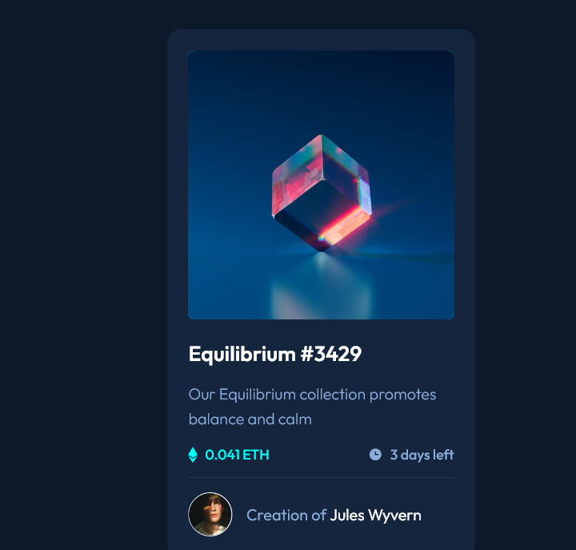

# Frontend Mentor - NFT preview card component solution

This is a solution to the [NFT preview card component challenge on Frontend Mentor](https://www.frontendmentor.io/challenges/nft-preview-card-component-SbdUL_w0U). 

## Table of contents

- [Frontend Mentor - NFT preview card component solution](#frontend-mentor---nft-preview-card-component-solution)
  - [Table of contents](#table-of-contents)
  - [Overview](#overview)
    - [The challenge](#the-challenge)
    - [Screenshot](#screenshot)
    - [Links](#links)
  - [My process](#my-process)
    - [Built with](#built-with)
    - [What I learned](#what-i-learned)
  - [Author](#author)

## Overview

### The challenge

Users should be able to:

- View the optimal layout depending on their device's screen size
- See hover states for interactive elements

### Screenshot

### Links

- Solution URL: [Github](https://github.com/clamonty/Frontendmentor.io/tree/main/Newbie/2.%20NFT%20Preview%20Card%20Component)
- Live Site URL: [Netlify](https://clamonty-nft-preview-card-component.netlify.app/)

## My process

### Built with

- Semantic HTML5 markup
- Flexbox
- CSS Grid
- SASS
- Mobile-first workflow

### What I learned

I always struggle with adding background image overlays on hover, so figuring this one out without any googling was nice. I would up making the background-color of an image container div the primary cyan, and changing the opacity of the eye icon and image when I hovered. 

Also I remembered the box shadow this time!

## Author

- Github - [clamonty](https://www.your-site.com)
- Frontend Mentor - [@yourusername](https://www.frontendmentor.io/profile/yourusername)

